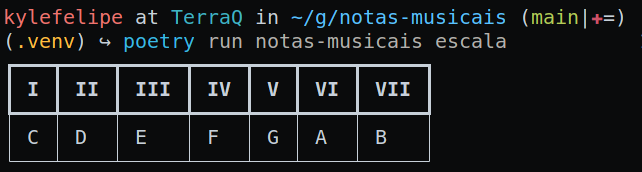

# Tutorial

O objetivo desse projeto é ajudar estudantes de música ou profissionais a obter fácil acesso a escalas, formação de acordes e campos harmônicos. Onde cada um desses comandos é distribuido em um subcomando no nosso `cli`.



## Os comandos

O `notas-musicais` distribui cada função em um subcomando e você pode exectuar cada um deles para testar agora. O objetivo desse tutorial é explicar o básico do funcionamento da aplicação em linha de comando.

Os subcomandos são divididos em três funções até o momento: `escala`, `acorde` e `campo-harmonico`.

Vamos entender o que cada um se propõe a fazer agora:

### Escala

O subcomando de escala no auxilia a ter fácil acesso a formação das escalas musicais.

Caso seja invocado sem nenhum parãmetro, retornará a escala de Dó maior:

```bash
{{ commands.run }} escalas
```

Com isso será fornecida uma tabela no terminal informando a escala:

```bash
┏━━━┳━━━━┳━━━━━┳━━━━┳━━━┳━━━━┳━━━━━┓
┃ I ┃ II ┃ III ┃ IV ┃ V ┃ VI ┃ VII ┃
┡━━━╇━━━━╇━━━━━╇━━━━╇━━━╇━━━━╇━━━━━┩
│ C │ D  │ E   │ F  │ G │ A  │ B   │
└───┴────┴─────┴────┴───┴────┴─────┘
```

Um exemplo no terminal:


